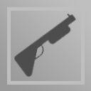
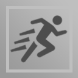

# TankShot

An online tank war game that I'm developing using **[Photon](https://www.photonengine.com/pun)**, **[Firebase](https://firebase.google.com/)** and **[Unity](https://unity.com/)**.

## UI
Lobby | Settings | Enemy Finding  
------------ | ------------- | -------------
||

Loading Arena | Arena | Match Result  
------------ | ------------- | -------------
 ||

## Used Technologies

* **Unity:** It was used to complete the development stages of the game, such as the creation of the game's mechanics and UI processes.
* **Photon:** Used for seamless creation of network and online game structure.
* **Firebase:** Used to store users' information and allow them to log into the game with their Google Play account.

## Gameplay
2 tanks are fighting in an arena. Bullets from tanks bounce off the walls. There are various features in the arena. Users try to gain superiority over each other by using these features. Also, the arena is randomly generated each time. There are 3 options for the game to conclude. These are winning, losing and drawing. The match ends in a draw when the match time expires or both tanks die. Apart from that, the living tank wins, while the dead tank loses. The scores obtained by the users at the end of the match are 0 points in case of a draw, while the scores are calculated according to the remaining time in winning or losing. The lower the time remaining, the lower the score achieved.

### Features

Laser | Shotgun | Speed | Shield
------------ | ------------- | ------------- | -------------
|||

* **Laser:** When the user gets this feature, they get a weapon with a very fast bullet with 1 shot.
* **Shotgun:** When the user gets this feature, they get 3 shots, slow bullets, and a gun that fires a lot of bullets per shot.
* **Speed:** When the user gets this feature, it moves fast for 5 seconds.
* **Shield:** When the user gets this feature, they take no damage for 5 seconds and have a shield that sends back bullets that land on them.

